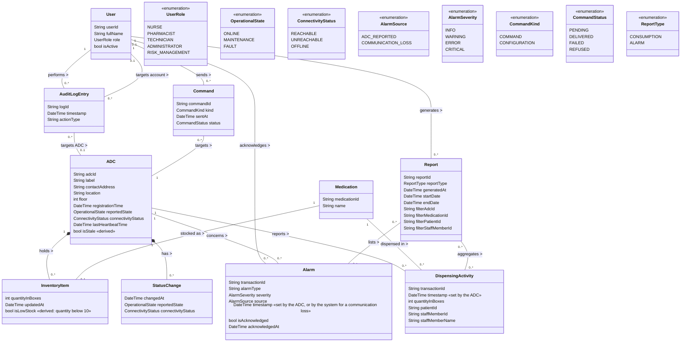

# Conceptual Domain / Class Model - Part B (Hospital Monitoring System)

```mermaid
classDiagram
    direction TB

    class User {
        String userId
        String fullName
        UserRole role
        bool isActive
    }

    class UserRole {
        <<enumeration>>
        NURSE
        PHARMACIST
        TECHNICIAN
        ADMINISTRATOR
        RISK_MANAGEMENT
    }

    class ADC {
        String adcId
        String label
        String contactAddress
        String location
        int floor
        DateTime registrationTime
        OperationalState reportedState
        ConnectivityStatus connectivityStatus
        DateTime lastHeartbeatTime
        bool isStale «derived»
    }

    class OperationalState {
        <<enumeration>>
        ONLINE
        MAINTENANCE
        FAULT
    }

    class ConnectivityStatus {
        <<enumeration>>
        REACHABLE
        UNREACHABLE
        OFFLINE
    }

    class StatusChange {
        DateTime changedAt
        OperationalState reportedState
        ConnectivityStatus connectivityStatus
    }

    class Medication {
        String medicationId
        String name
    }

    class InventoryItem {
        int quantityInBoxes
        DateTime updatedAt
        bool isLowStock «derived: quantity below 10»
    }

    class Alarm {
        String transactionId
        String alarmType
        AlarmSeverity severity
        AlarmSource source
        DateTime timestamp «set by the ADC, or by the system for a communication loss»
        bool isAcknowledged
        DateTime acknowledgedAt
    }

    class AlarmSource {
        <<enumeration>>
        ADC_REPORTED
        COMMUNICATION_LOSS
    }

    class AlarmSeverity {
        <<enumeration>>
        INFO
        WARNING
        ERROR
        CRITICAL
    }

    class DispensingActivity {
        String transactionId
        DateTime timestamp «set by the ADC»
        int quantityInBoxes
        String patientId
        String staffMemberId
        String staffMemberName
    }

    class Command {
        String commandId
        CommandKind kind
        DateTime sentAt
        CommandStatus status
    }

    class CommandKind {
        <<enumeration>>
        COMMAND
        CONFIGURATION
    }

    class CommandStatus {
        <<enumeration>>
        PENDING
        DELIVERED
        FAILED
        REFUSED
    }

    class AuditLogEntry {
        String logId
        DateTime timestamp
        String actionType
    }

    class Report {
        String reportId
        ReportType reportType
        DateTime generatedAt
        DateTime startDate
        DateTime endDate
        String filterAdcId
        String filterMedicationId
        String filterPatientId
        String filterStaffMemberId
    }

    class ReportType {
        <<enumeration>>
        CONSUMPTION
        ALARM
    }

    %% Relationships and multiplicities
    User "1" -- "0..*" AuditLogEntry : performs >
    AuditLogEntry "0..*" -- "0..1" User : targets account >
    AuditLogEntry "0..*" -- "0..1" ADC : targets ADC >
    User "0..1" -- "0..*" Alarm : acknowledges >
    User "1" -- "0..*" Report : generates >
    User "1" -- "0..*" Command : sends >
    Command "0..*" -- "1" ADC : targets >

    ADC "1" *-- "0..*" InventoryItem : holds >
    Medication "1" -- "0..*" InventoryItem : stocked as >
    ADC "1" *-- "0..*" StatusChange : has >

    ADC "1" -- "0..*" Alarm : concerns >
    ADC "1" -- "0..*" DispensingActivity : reports >
    Medication "1" -- "0..*" DispensingActivity : dispensed in >

    Report "0..*" -- "0..*" Alarm : lists >
    Report "0..*" -- "0..*" DispensingActivity : aggregates >
```
