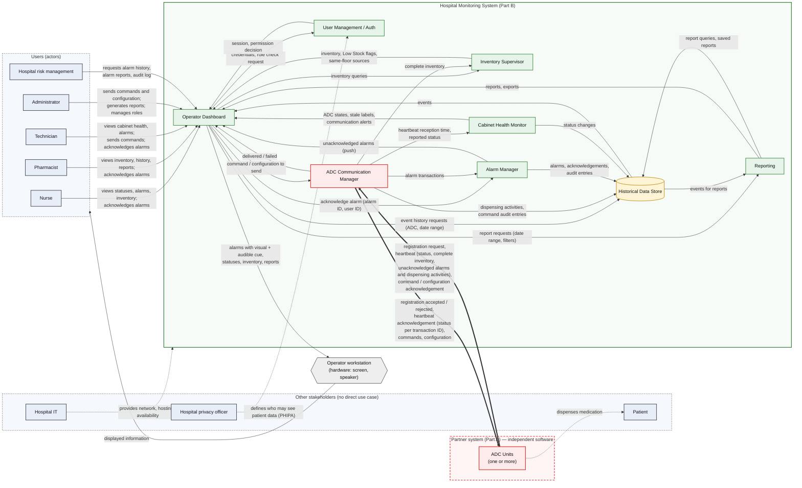

# High-Level Architecture Diagram — Part B (Hospital Monitoring System)

```mermaid
flowchart LR
    subgraph Users["Users (actors)"]
        direction TB
        Nurse["Nurse"]
        Pharmacist["Pharmacist"]
        Technician["Technician"]
        Admin["Administrator"]
        RiskMgmt["Hospital risk management"]
    end

    subgraph Governing["Other stakeholders (no direct use case)"]
        direction TB
        Patient["Patient"]
        Privacy["Hospital privacy officer"]
        IT["Hospital IT"]
    end

    Workstation{{"Operator workstation<br/>(hardware: screen, speaker)"}}

    subgraph MS["Hospital Monitoring System (Part B)"]
        direction TB
        Dashboard["Operator Dashboard"]
        UserMgmt["User Management / Auth"]
        InvSup["Inventory Supervisor"]
        AlarmMgr["Alarm Manager"]
        HealthMon["Cabinet Health Monitor"]
        Reporting["Reporting"]
        HistStore[("Historical Data Store")]
        CommMgr["ADC Communication Manager"]
    end

    subgraph Partner["Partner system (Part A) — independent software"]
        ADCUnits["ADC Units<br/>(one or more)"]
    end

    %% ===== Users <-> Dashboard (via the workstation) =====
    Nurse -- "views statuses, alarms, inventory;<br/>acknowledges alarms" --> Dashboard
    Pharmacist -- "views inventory, history, reports;<br/>acknowledges alarms" --> Dashboard
    Technician -- "views cabinet health, alarms;<br/>sends commands; acknowledges alarms" --> Dashboard
    Admin -- "sends commands and configuration;<br/>generates reports; manages roles" --> Dashboard
    RiskMgmt -- "requests alarm history,<br/>alarm reports, audit log" --> Dashboard
    Dashboard -- "alarms with visual + audible cue,<br/>statuses, inventory, reports" --> Workstation
    Workstation -- "displayed information" --> Users

    %% ===== Dashboard <-> internal components =====
    Dashboard -- "credentials, role check request" --> UserMgmt
    UserMgmt -- "session, permission decision" --> Dashboard
    Dashboard -- "inventory queries" --> InvSup
    InvSup -- "inventory, Low Stock flags,<br/>same-floor sources" --> Dashboard
    Dashboard -- "acknowledge alarm (alarm ID, user ID)" --> AlarmMgr
    AlarmMgr -- "unacknowledged alarms (push)" --> Dashboard
    HealthMon -- "ADC states, stale labels,<br/>communication alerts" --> Dashboard
    Dashboard -- "report requests (date range, filters)" --> Reporting
    Reporting -- "reports, exports" --> Dashboard
    Dashboard -- "event history requests (ADC, date range)" --> HistStore
    HistStore -- "events" --> Dashboard
    Dashboard -- "command / configuration to send" --> CommMgr
    CommMgr -- "delivered / failed" --> Dashboard

    %% ===== ADC Communication Manager -> internal components =====
    CommMgr -- "complete inventory" --> InvSup
    CommMgr -- "alarm transactions" --> AlarmMgr
    CommMgr -- "heartbeat reception time,<br/>reported status" --> HealthMon
    CommMgr -- "dispensing activities,<br/>command audit entries" --> HistStore

    %% ===== Components -> Historical Data Store =====
    AlarmMgr -- "alarms, acknowledgements,<br/>audit entries" --> HistStore
    HealthMon -- "status changes" --> HistStore
    Reporting -- "report queries, saved reports" --> HistStore
    HistStore -- "events for reports" --> Reporting

    %% ===== Other stakeholders (dashed = indirect relationship) =====
    Privacy -. "defines who may see patient data (PHIPA)" .-> UserMgmt
    IT -. "provides network, hosting, availability" .-> MS
    ADCUnits -. "dispenses medication" .-> Patient

    %% ===== ADC <-> Monitoring System boundary =====
    ADCUnits == "registration request,<br/>heartbeat (status, complete inventory,<br/>unacknowledged alarms and dispensing activities),<br/>command / configuration acknowledgement" ==> CommMgr
    CommMgr == "registration accepted / rejected,<br/>heartbeat acknowledgement (status per transaction ID),<br/>commands, configuration" ==> ADCUnits

    classDef actor fill:#e8eef7,stroke:#334,stroke-width:1.5px,color:#112;
    classDef component fill:#e6f4ea,stroke:#2e7d32,stroke-width:1.5px,color:#111;
    classDef store fill:#fff4d6,stroke:#b8860b,stroke-width:1.5px,color:#111;
    classDef hardware fill:#eeeeee,stroke:#555,stroke-width:1.5px,color:#111;
    classDef partner fill:#fdeaea,stroke:#d33,stroke-width:2px,color:#111;
    class Nurse,Pharmacist,Technician,Admin,RiskMgmt actor;
    class Patient,Privacy,IT actor;
    class Dashboard,UserMgmt,InvSup,AlarmMgr,HealthMon,Reporting component;
    class CommMgr partner;
    class HistStore store;
    class Workstation hardware;
    class ADCUnits partner;
    style Governing fill:#f5f8fc,stroke:#334,stroke-dasharray: 3 3
    style Users fill:#f5f8fc,stroke:#334,stroke-dasharray: 3 3
    style Partner fill:#fff5f5,stroke:#d33,stroke-width:2px,stroke-dasharray: 6 4
    style MS fill:#f7fbf8,stroke:#2e7d32,stroke-width:2px
```
